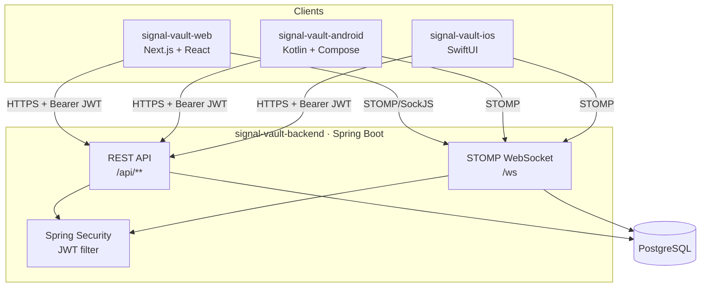
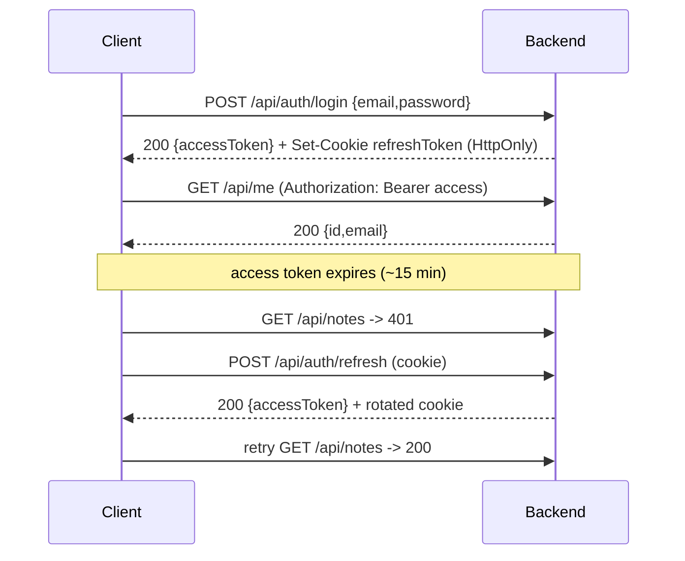

# SignalVault — Architecture

SignalVault is a multi-platform, security-focused product: one shared backend and three
native/web clients that all implement the same flows (auth, biometric/passphrase vault,
client-side-encrypted notes, realtime rooms).

## System overview



## Auth & token flow



- **Web**: access token in memory (React context), refresh token in an HttpOnly cookie.
- **Android**: tokens in Android Keystore-backed encrypted DataStore.
- **iOS**: tokens in Keychain.

## Client-side encryption (zero-knowledge notes and rooms)

The vault key never leaves the client. Plaintext is encrypted locally (AES-GCM) and only
ciphertext is sent to the backend.

- **Web**: Web Crypto (`SubtleCrypto`) AES-GCM-256; key derived from a passphrase via
  PBKDF2-SHA256 (250 000 iterations). Passkeys/WebAuthn (PRF extension) is the roadmap
  upgrade to wrap the key.
- **Rooms**: each room has a random client-generated room key. Every member stores an
  encrypted copy of that room key, wrapped by their own vault key. Messages are encrypted
  with the room key, persisted as ciphertext, and broadcast over STOMP.
- **Invites**: owners invite an existing user by email and share an invite link whose URL
  fragment contains the room key. The invited browser encrypts that key with the invitee's
  vault key when accepting, so the backend never receives the raw key.
- **Android**: Android Keystore + BiometricPrompt gate; AES-GCM via Keystore key.
- **iOS**: Keychain + LocalAuthentication (Face/Touch ID); CryptoKit AES-GCM.

### Maximum security notes

A note flagged `highSecurity = true` is encrypted with a per-note password instead of the
vault key. The encryption primitive is the same (AES-GCM-256 + PBKDF2 via
`encryptString(content, notePassword)`). The backend stores the ciphertext unchanged and
the `highSecurity` boolean. Losing the note password = permanent data loss by design.

### Maximum security rooms (password proposal mechanism)

A room can require all members to verify a shared room password before accessing messages.
The design keeps the password zero-knowledge:

```
Client                                    Server
──────────────────────────────────────────────────────────────────
passwordVerifier = encryptString("signalvault:room-password:v1",
                                  proposedPassword)

POST /password-proposals
  { proposedPassword (plaintext for voting),
    passwordVerifier (ciphertext for verification) }
                          ──────────────────────►  stores both fields
                                                   in room_password_proposals

All members vote:
  ACCEPT: unanimously → server copies passwordVerifier
                         to rooms.password_verifier
                         sets rooms.high_security = true
  REJECT (any one):   → proposal = REJECTED,
                         verifier unchanged

To enter the room:
  client decrypts room.passwordVerifier with entered password
  checks sentinel == "signalvault:room-password:v1"
  ✓ correct → marks room as unlocked in memory (Zustand)
  ✗ wrong   → stays locked; no network call needed
```

**Invariants the backend enforces:**

1. Only one PENDING proposal per room at a time (creating a new one cancels the current).
2. Each user can vote exactly once per proposal (UNIQUE constraint on proposal_id + user_id).
3. One REJECT immediately moves the proposal to REJECTED (no waiting).
4. Unanimous ACCEPT triggers `room.passwordVerifier` update in the same transaction.
5. Only the room owner can flip `highSecurity` on/off via `PATCH /{id}/security`.

**Audit trail:** every resolved proposal is copied to `room_password_history` with the list
of accept/reject voters and timestamps. The history is immutable and visible to all members.

## Module map

| Component               | Stack                                    | Status                                   |
|-------------------------|------------------------------------------|------------------------------------------|
| `signal-vault-backend`  | Spring Boot, Spring Security, JPA, STOMP | Auth, notes, rooms, high-security        |
| `signal-vault-web`      | Next.js (App Router), TanStack Query     | Auth, vault, realtime, high-security UX  |
| `signal-vault-android`  | Kotlin, Compose, Clean Arch              | Skeleton + roadmap                       |
| `signal-vault-ios`      | SwiftUI, Clean Arch                      | Skeleton + roadmap                       |

### Key new backend tables (Flyway V3)

| Table                      | Purpose                                                                    |
|----------------------------|----------------------------------------------------------------------------|
| `room_password_proposals`  | Active and historical password change requests per room                    |
| `room_password_votes`      | One row per (proposal, user); enforces one-vote-per-user uniqueness        |
| `room_password_history`    | Immutable audit log; every resolved proposal is copied here                |

`secure_notes.high_security` and `rooms.high_security + rooms.password_verifier` columns
were added in V3 with non-breaking defaults (`DEFAULT FALSE`, `NULL`).

See [`api.md`](./api.md) for the contract and [`security.md`](./security.md) for the
security model. Architecture decisions live under [`adr/`](./adr).
