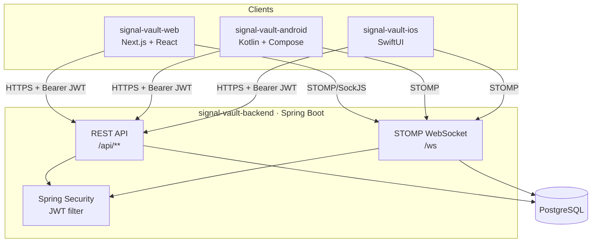
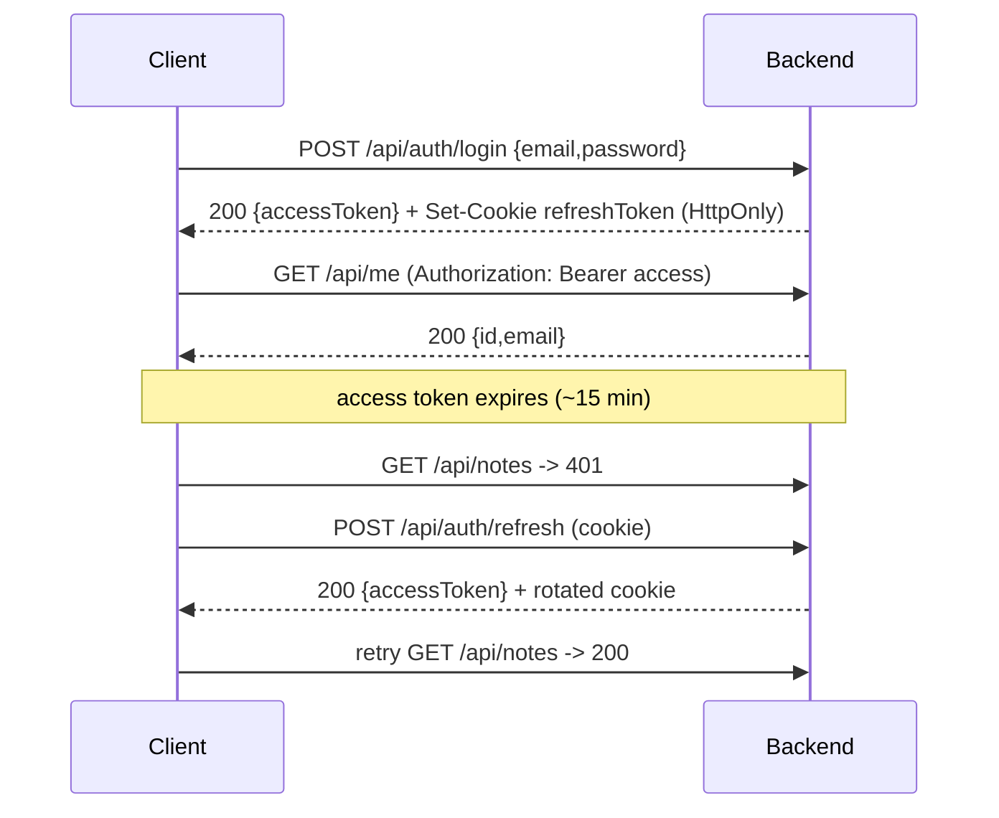

# SignalVault — Architecture

SignalVault is a multi-platform, security-focused product: one shared backend and three
native/web clients that all implement the same flows (auth, biometric/passphrase vault,
client-side-encrypted notes, realtime rooms).

## System overview

## Auth & token flow

- **Web**: access token in memory (React context), refresh token in an HttpOnly cookie.
- **Android**: tokens in Android Keystore-backed encrypted DataStore.
- **iOS**: tokens in Keychain.

## Client-side encryption (zero-knowledge notes)

The vault key never leaves the client. Plaintext is encrypted locally (AES-GCM) and only
ciphertext is sent to the backend.

- **Web**: Web Crypto (`SubtleCrypto`) AES-GCM; key derived from a passphrase via PBKDF2.
  Passkeys/WebAuthn (PRF extension) is the roadmap upgrade to wrap the key.
- **Android**: Android Keystore + BiometricPrompt gate; AES-GCM via Keystore key.
- **iOS**: Keychain + LocalAuthentication (Face/Touch ID); CryptoKit AES-GCM.

## Module map

| Component               | Stack                                   | Status (this pass)        |
|-------------------------|-----------------------------------------|---------------------------|
| `signal-vault-backend`  | Spring Boot, Spring Security, JPA, STOMP | Auth → notes → rooms      |
| `signal-vault-web`      | Next.js (App Router), TanStack Query     | Auth → vault → realtime   |
| `signal-vault-android`  | Kotlin, Compose, Clean Arch              | Skeleton + roadmap        |
| `signal-vault-ios`      | SwiftUI, Clean Arch                      | Skeleton + roadmap        |

See [`api.md`](./api.md) for the contract and [`security.md`](./security.md) for the
security model. Architecture decisions live under [`adr/`](./adr).
